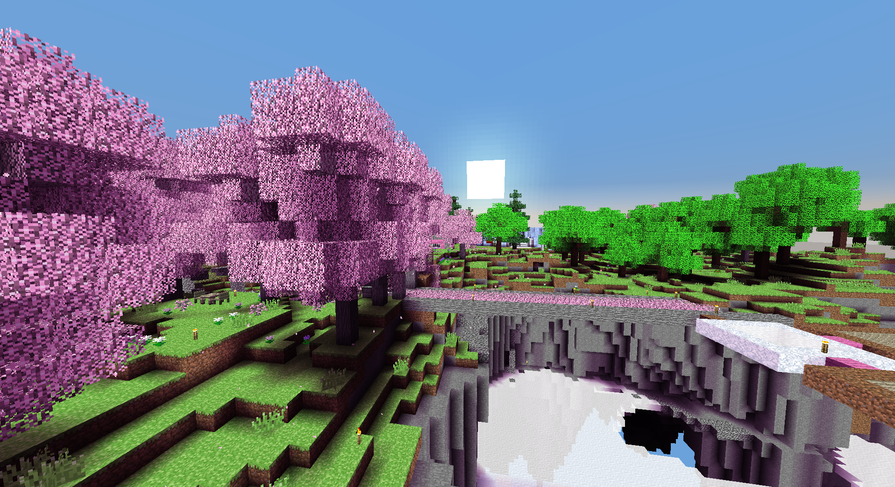

# KivaAlmostShader
This is not a shader, it scales vertex colors in `Tesselator.java`\
Enable Smooth Lighting in Video settings, it will look weird without it

# Commands
`/shader` - Toggle the "shader"\
`/colortint` - Toggle the color tint, keeping only the increased contrast\
`/brightershadows` - Toggle vanilla shadows basically

# Known issues
- Makes some menus look darker (The durability bar for tools gets kinda messed up)
- Commands do not toggle immediately, it's kind of like changing your gamma
- The look of entities, signs, chairs and rain aren't affected by this mod
- Tints everything slightly pink/purple (not a bug, it's a feature!) (`/colortint` to toggle)
